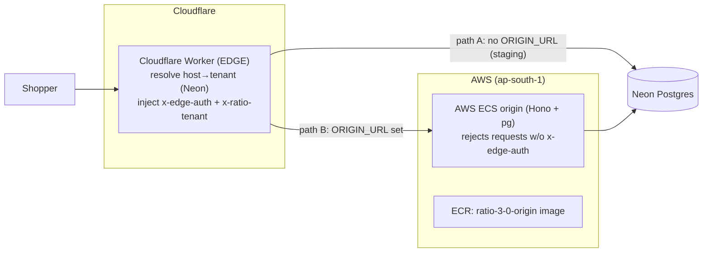

# Ratio 3.0 — Infrastructure & Architecture

Multi-tenant storefront platform. One shared, stateless host serves every tenant;
a merchant is **data** (rows keyed by `tenant_id`), not a deployment.

> **Secrets policy:** this doc lists secret **names and purpose only** — never values.
> Values live in GitHub Actions secrets, Cloudflare Worker secrets, and the ECS
> service env. `.env` is git-ignored (only `.env.example` is tracked).

## Architecture



- **Edge** = Cloudflare Worker (`src/worker.ts`, Hono). Resolves `host → tenantId`
  (from Neon, or `?store=` demo fallback), then **path B**: injects the trusted
  `x-edge-auth` + `x-ratio-tenant` headers and proxies to the private ECS origin;
  **path A** (no `ORIGIN_URL`): renders directly from Neon (staging fallback).
- **Origin** = AWS **ECS Express Mode** container (`src/origin-server.ts`, Hono + `pg`).
  Private by contract: refuses any request without the correct `x-edge-auth`.
- **DB** = **Neon** serverless Postgres (tenant-keyed: `tenants`, `domains`, `routes`).
- **Registry** = AWS **ECR** (`ratio-3-0-origin`), region `ap-south-1` (Mumbai).
- **CI/CD** = GitHub Actions.

## Stack (ADR-012 / S0)

Cloudflare Workers (edge) · AWS ECS Express Mode (origin) · Neon (Postgres) ·
Hono (framework) · TypeScript · `tsx` (run) · `node:test` (tests) · Docker.

## Live URLs

| URL | What |
| --- | --- |
| `https://ratio-3-0.ramvishvas-kumar.workers.dev/?store=t_acme` | Worker (workers.dev), tenant via `?store=` |
| `https://acme.ratiodev.in` / `https://beta.ratiodev.in` | real host→tenant on platform subdomains |
| `https://<tenant>.ratiodev.in` | any onboarded merchant subdomain |

## Cloud accounts / identifiers (non-secret)

| Thing | Value |
| --- | --- |
| Cloudflare account ID | `7f06c71e716a0e4a5d38073c16758c60` (in `wrangler.toml`) |
| Cloudflare zone | `ratiodev.in` (NS: `colin` / `romina.ns.cloudflare.com`) |
| AWS account | `844310781883` |
| AWS region | `ap-south-1` (Mumbai) |
| AWS IAM CI user | `ratio-3-0-ci` (ECR PowerUser) |
| ECR repo | `ratio-3-0-origin` |
| Worker name | `ratio-3-0` |

## Environment variables & secrets

### GitHub Actions — Secrets (values hidden)
| Name | Used by | Purpose |
| --- | --- | --- |
| `CLOUDFLARE_API_TOKEN` | deploy, cf-* workflows | deploy Worker; manage DNS/routes/custom-hostnames. Scopes: Workers Scripts:Edit, Workers Routes:Edit, Zone:Read, DNS:Edit (+ SSL&Certificates:Edit needed to finish Cloudflare-for-SaaS) |
| `DATABASE_URL` | CI migrate/seed; Worker secret; ECS env | Neon connection string |
| `AWS_ACCESS_KEY_ID` | origin-image | ECR push (IAM user `ratio-3-0-ci`) |
| `AWS_SECRET_ACCESS_KEY` | origin-image | ECR push |
| `ORIGIN_URL` | deploy (→ Worker secret) | ECS origin base URL (enables path B) |
| `EDGE_SECRET` | deploy (→ Worker secret) | shared secret; edge injects it, origin verifies it (private-origin boundary) |

### GitHub Actions — Variables (non-secret)
| Name | Value | Purpose |
| --- | --- | --- |
| `AWS_REGION` | `ap-south-1` | region for ECR |
| `DEPLOY_AWS` | `true` | gate for the `origin-image` job |
| `PATH_B` | `true` | gate to push `ORIGIN_URL`/`EDGE_SECRET` to the Worker |

### Cloudflare Worker — secrets (set via `wrangler secret put` in CI)
`DATABASE_URL` (Neon) · `ORIGIN_URL` (ECS) · `EDGE_SECRET` (shared).
Worker config in `wrangler.toml`: `name`, `account_id`, route `*.ratiodev.in/*`.

### AWS ECS origin — service env vars
`DATABASE_URL` (Neon) · `EDGE_SECRET` (must equal the Worker's) · `PORT` (injected; origin binds `0.0.0.0:$PORT`, default 8080).

### App/local env (`src`, `.env` — git-ignored)
`DATABASE_URL` (local Postgres) · `EDGE_SECRET` (default `private-link-secret` if unset — **set a real value in prod**) · `ORIGIN_PORT`/`EDGE_PORT` (local two-server run) · `TEST_DATABASE_URL`/`ADMIN_URL` (test DB).

## CI/CD workflows (`.github/workflows/`)

| Workflow | Trigger | Does |
| --- | --- | --- |
| `ci.yml` | push/PR to main | **build**: typecheck + lint + format:check + `npm audit` + tests on a Postgres service. **deploy** (main): migrate+seed Neon, `wrangler deploy`, set Worker secrets. **origin-image** (gated `DEPLOY_AWS`): build + push origin image to ECR. |
| `onboard.yml` | manual | Onboard a merchant into Neon (tenant + host + home route) — "merchant = data". |
| `cf-setup-domain.yml` | manual | Create proxied DNS records for subdomains + the `*.ratiodev.in/*` Worker route. |
| `cf-saas.yml` | manual | Cloudflare-for-SaaS: fallback origin + `*/*` route + register a merchant custom hostname (BYO domain). |
| `cf-add-zone.yml` / `cf-zone-info.yml` | manual | Create a CF zone / read zone status + nameservers. |
| `aws-check.yml` | manual | Verify AWS creds (`sts get-caller-identity`). |

## Setup performed (what got provisioned)

1. **Repo**: `primathontech/ratio-3.0`, TypeScript + TDD + CI/CD + enterprise baseline
   (ESLint, Prettier, Docker, husky, Dependabot, health probes).
2. **Neon**: serverless Postgres; schema via migrations (`db/migrations/*.sql` + runner);
   seeded tenants/domains/routes.
3. **AWS**: IAM user `ratio-3-0-ci` (ECR push) → keys in GitHub secrets; ECR repo
   `ratio-3-0-origin`; **ECS Express Mode** service from that image (port 8080,
   health `/health`, env `DATABASE_URL` + `EDGE_SECRET`).
4. **Cloudflare**: Worker `ratio-3-0` deployed; zone `ratiodev.in` (moved from GoDaddy);
   proxied DNS records `acme` / `beta` / `<tenant>`; Worker route `*.ratiodev.in/*`.
5. **Path B wired**: `ORIGIN_URL` + `EDGE_SECRET` set on the Worker → edge proxies to
   the private ECS origin.

## Onboard a new merchant (platform subdomain)

1. Run **`onboard.yml`** (`id`, `name`, `host=<sub>.ratiodev.in`, `color`) → Neon rows.
2. Run **`cf-setup-domain.yml`** (`subs=<sub>`) → proxied DNS record (the wildcard
   Worker route already serves it).
3. `https://<sub>.ratiodev.in` is live (allow a few min for DNS propagation of a new
   record; the record is created immediately).

_On Enterprise (proxied wildcard DNS), step 2 + the propagation wait disappear._

## Local dev

```
cp .env.example .env          # point DATABASE_URL at local Postgres
npm install
npm run db:init               # migrate + seed
npm start                     # edge :8080 + origin :9090 (two-server sim)
npm test                      # node:test against s2poc_test
npm run prove ; npm run prove:s1   # full-stack proofs
```

## Known gaps / on-hold

- **Merchant BYO-domains** (Cloudflare for SaaS) — paused; needs SaaS enabled on the
  zone + `SSL and Certificates:Edit` on the token (see Jira OFCE-359).
- Cache-Tag exact purge · ECS auto-redeploy on ECR push · un-mock the theme engine.
- ADRs still **Proposed** (ratify) · Phase-0 strategy gate.
