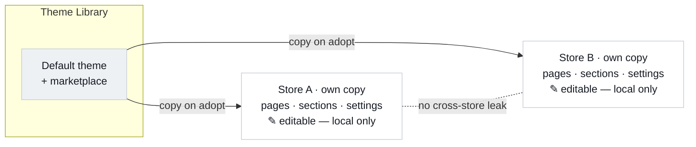
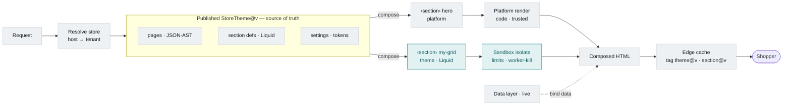
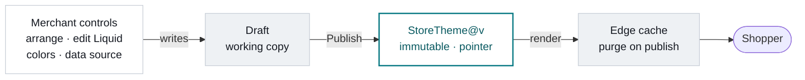

# ADR-0003: Merchant themes & sections — per-store copies, sandboxed Liquid, one render source of truth

**Status:** proposed (2026-08-12) · extends [ADR-013](https://prima.atlassian.net/wiki/spaces/R3/pages/20480003) (page builder)

## Context

ADR-013 fixed the render pipeline: authoring tiers → a **JSON-AST** page contract → a **section
registry** (`type → render + settings + bindings`) → resolve bindings → render → cacheability tier →
edge cache. Untrusted rendering already runs in a **sandboxed LiquidJS worker-thread isolate** (D40 —
allowlist filters, resource limits, worker-kill).

What's missing is **merchant code access**. Today a section's `type` only renders if it is **baked
into the code registry** — adding a "product grid" is a code change and a deploy, and a merchant can
never author or edit one. We also have no per-store theme ownership model.

The audience decides the shape: **most merchants migrate from Shopify**, so they arrive with Shopify's
mental model. We should give them the same flexibility — a shared default theme, their **own editable
copy** of it, real code access to sections — rather than a novel model they have to relearn.

The single change that unlocks it: the section registry stops being a compile-time map of code and
becomes a **runtime resolver** that reads section definitions from **data**, so a merchant can create a
section that exists only in their store — no deploy. The JSON-AST does not change; only how `type`
resolves does.

## Decision

### 1. A theme is a per-store copy (copy-on-adopt)

A shared **default theme** (and, later, marketplace themes) lives in a **Theme Library**. Adopting a
theme **copies it into the store** as that store's own theme. From then on the merchant edits **their
copy** — arrangement, section code, colors, data sources — and it changes **only their store**. Nothing
propagates back to the library or to another merchant. A store may hold several copies (a live one +
drafts), like Shopify's theme list; publish swaps which is live.



_The library is a seed, not a live link. "I edited my theme" can never touch anyone else because every
store's theme is its own copy._

### 2. Two section flavors — the same split Shopify uses

|                | Platform sections                        | Theme sections                              |
| -------------- | ---------------------------------------- | ------------------------------------------- |
| What           | first-party blocks (hero, product-grid…) | custom, + whatever an adopted theme brought |
| Form           | **code**, trusted fast-path              | **Liquid**, sandboxed                       |
| Live where     | central — **referenced** by `type`       | **copied into** the store's theme           |
| Updated by     | the platform, centrally                  | the merchant, locally (a fork)              |
| Shopify analog | app blocks / core                        | theme sections                              |

**Merchant code = Liquid**, rendered through the existing D40 isolate — safe by construction, no new
sandbox to build. **Arbitrary JS/TS is a separate developer/app tier** (the apps-platform + the open
OFCE-492 first-party spike), not something every merchant gets.

**Section vs app — the line:** a **section** is Liquid + settings + bindings, lives _in the theme_,
sandboxed, authored by the merchant. An **app** is arbitrary JS/TS, lives _outside the theme_ in the
apps-platform sandbox, authored by developers, talks over the bridge. **Rule:** anything that needs a
real programming runtime is an _app_, not a _section_. Sections stay declarative Liquid.

### 3. The source of truth for render = the published store-theme version

One immutable snapshot per store, behind a movable "published" pointer (the same primitive as theme
versioning in ADR-013, which doubles as the edge-cache key):

```
StoreTheme@version {
  pages      // JSON-AST per route — the merchant's arrangement
  sections   // this theme's own Liquid defs (copied in) — { schema, bindings, template }
  settings   // tokens, colors, chrome, globals
}
// platform section types resolve to central code; theme types resolve from THIS snapshot.
// edge caches on the pointer → publish flips it + purges. live data is the only non-pinned input.
```

Given **(published StoreTheme version + live data)** a page renders **deterministically** — nothing
else is consulted. The 3-tier lookup (tenant → library → first-party) is an **authoring-time** concern
("what can I add?"); at **render time** the snapshot has already pinned the exact versions.



_A platform section type renders from trusted code; the theme's own type renders its Liquid **through
the sandbox** — that accent path is the merchant's code access._

### 4. Distribution = the library; adopt = copy; publish = the merchant's edit reaching a shopper

Sections are authored and shared in the library (versioned, content-addressed); **installing copies**
the definition into the store's theme. A merchant's edits write to a **draft**; **publish** freezes an
immutable `StoreTheme@v` and moves the pointer, which purges and re-renders.



The four merchant controls all write to the draft: **arrange** (pages/JSON-AST), **edit code** (a theme
section's Liquid), **colors** (settings/tokens), **connect data** (a section's declared binding, via
`@shopkit/data-layer`).

### 5. Section definition — the stored contract

Today this is code; move it to data. The JSON-AST node (`{id, type, props, children[]}`) is unchanged.

```
SectionDefinition {
  type            // stable key the JSON-AST references
  version         // immutable snapshot id
  scope           // first-party | tenant | library
  settingsSchema  // typed controls → drives the editor form
  bindings        // declared data needs (allowlisted sources)
  template        // the render logic — Liquid, stored as text
  meta            // name, icon, category, author, timestamps
}
```

Theme (Liquid) section defs are **copied into** the store-theme snapshot. Template text lives in the DB
(it's small); **S3 is reserved** for large assets and any future JS/app bundles.

## Consequences

- **No new sandbox.** Merchant code is Liquid, so it reuses the D40 isolate — safe multi-tenant by
  construction. The whole design hinges on this.
- **Deterministic render, one cache primitive.** Render reads only the published snapshot + live data;
  the edge caches on the theme pointer; publish flips it and purges. Editing a section adds a
  `section:<id>@<ver>` surrogate tag so a publish purges exactly the pages that use it.
- **Isolation is structural.** Per-store copies mean a merchant's edits can't affect the library or
  another store — no shared mutable section that could leak.
- **Adopted content is a fork.** Updating an adopted theme/section is a re-adopt/merge (the Shopify
  update story merchants already know); **only platform sections auto-update**, because those are the
  referenced ones. Central auto-updating marketplace sections (app-block style) is a later option.
- **Isolate cost at scale.** The isolate spawns one worker per render (see `isolate.ts` TODO); a page
  full of custom sections needs a **worker pool** + a start-on-ready render budget.
- **The section↔app boundary must be enforced** so neither grows into arbitrary code in the storefront.

## Rollout (POC-first — a slice is done only when a runnable proof shows it end-to-end)

- **P0 — prove the render seam.** Store-theme snapshot + the resolver. Onboard a store → it gets a
  _copy_ of the default theme → render a page from its own theme version, including **one** custom
  Liquid section the store owns, through the isolate. _Done when a page renders a section that exists
  only in that store's theme copy._
- **P1 — authoring & the four controls.** Editor for Liquid + settings schema + bindings + colors; the
  custom section shows up and configures like a first-party one.
- **P2 — versioning & publish.** Immutable store-theme versions + movable pointer + rollback, wired to
  `theme@v` / `section@v` purge.
- **P3 — performance.** Isolate worker pool + start-on-ready render budget.
- **P4 — distribution (later).** Publish themes/sections to the library; adopt = copy; marketplace; S3
  for large artifacts.

## Open questions

1. **Binding surface** — same declarative collection/product surface as first-party, or a tighter
   allowlist for merchant sections?
2. **Marketplace section updates** — pure copy (Shopify re-adopt) vs an app-block-style referenced
   section that auto-updates. Copy for v1.
3. **Editor DX** — live preview, error surfacing, schema authoring for non-developers.
4. **Dogfooding** — keep first-party sections in code, or backfill a few as theme sections to exercise
   the path?

## References

- ADR-013 — page builder (JSON-AST render-at-edge, custom editor, authoring tiers §5.1).
- D40 — untrusted-render worker-thread isolate (`packages/builder-render/`).
- OFCE-492 — first-party sections: Liquid vs TS (open spike).
- Visual walkthrough: the three "how it works" views (copy-on-adopt · edit→publish→shopper · render internals).
