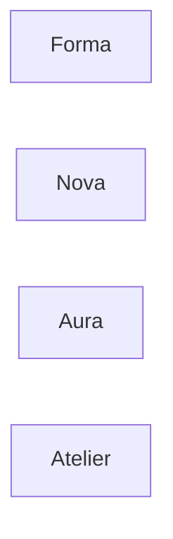
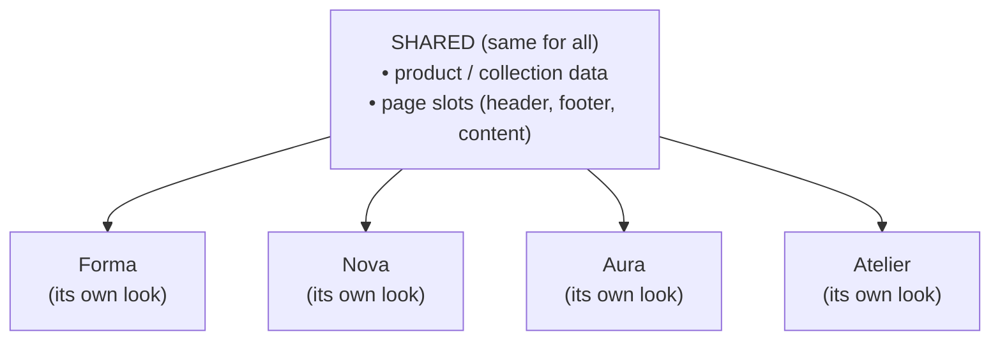
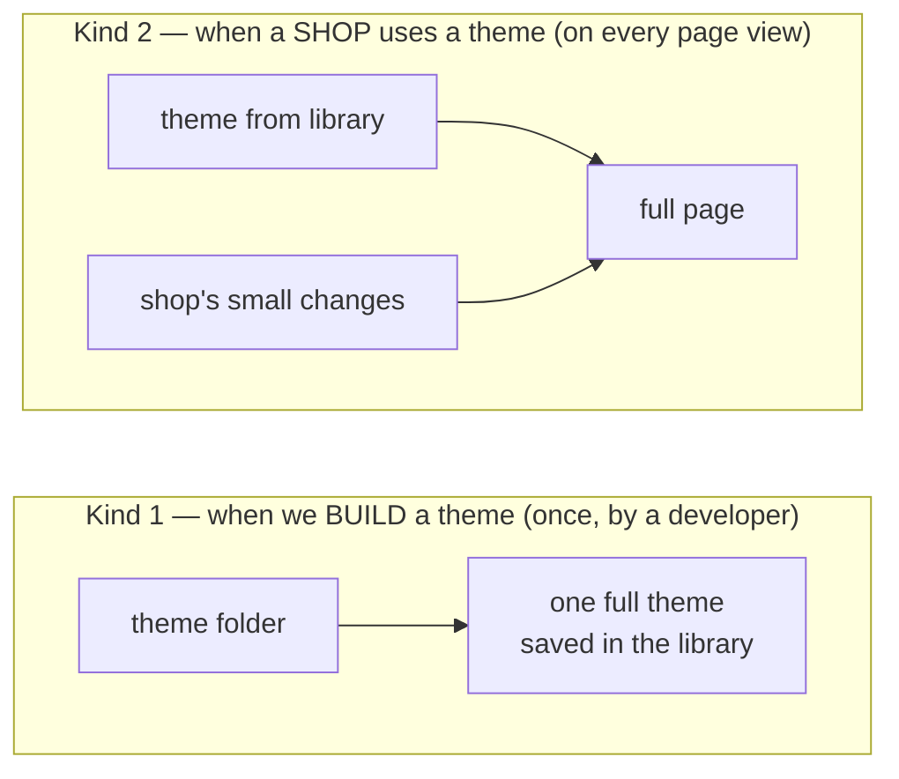
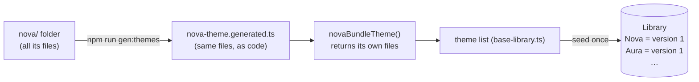
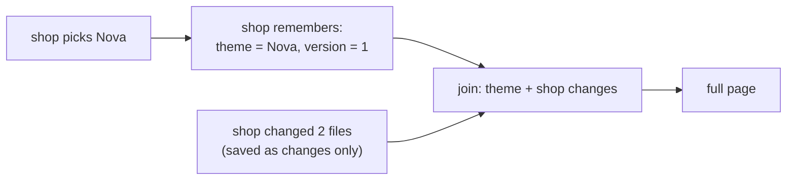
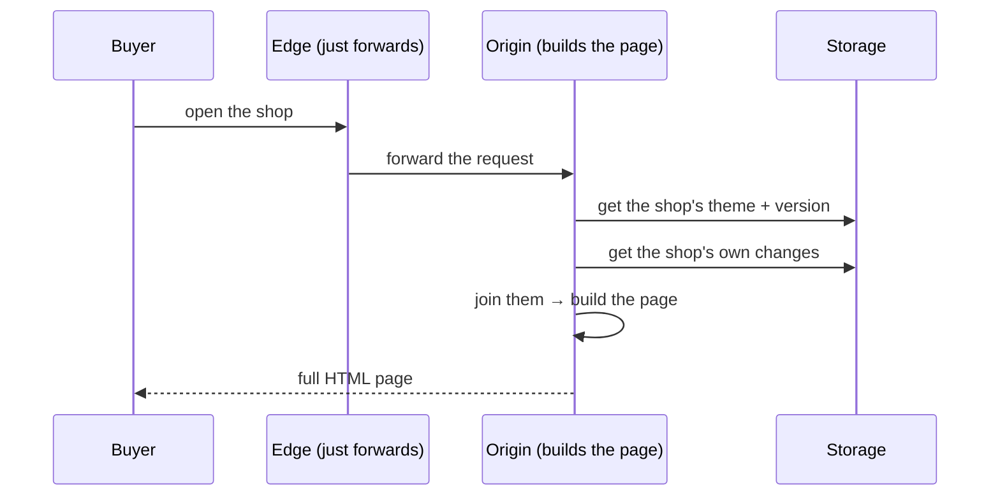
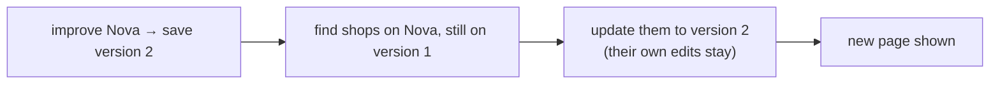
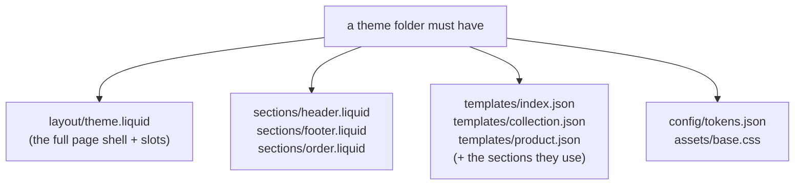

# How the theme system works

A **theme** is the _look_ of a shop — its home page, header, footer, product page, colours and fonts.

We have four themes today. **Each one is a full, complete theme on its own.**

---

## What do themes share? Only the data and the page rules — not the look

Themes do **not** share their look. Every theme can look totally different.
They share just two things:

1. **The data** — products and collections (same for every theme).
2. **The page rules** — where the header, footer and content go (same slots for every theme).

So: **same data, different look.** A theme can have a different home, header, footer, collection page and
product page — only the data behind them is the same.

---

## The one thing that confuses people: two kinds of "mixing"

The word "mix / combine" is used in **two totally different places**. Please keep them apart.

|            | Kind 1 — build time                    | Kind 2 — shop time               |
| ---------- | -------------------------------------- | -------------------------------- |
| When       | once, when a developer makes the theme | every time someone opens a shop  |
| What joins | files in the theme folder → one theme  | the theme + the shop's own edits |
| Result     | one full theme in the library          | the full page shown to the buyer |

---

## Kind 1 — how a theme is built and saved

Each theme is just a **folder of files** (home page, header, footer, product page, style, and so on).
A small script (`npm run gen:themes`) turns that folder into code. The theme is then saved **once** in
the library as "version 1".

Two important points:

- **Saved once, then frozen.** After a theme is saved in the library, it does **not** change by itself.
- **Each saved theme is complete.** Nova in the library has _all_ its own files. It does not borrow
  anything from Forma to work.

> Long ago Nova/Aura/Atelier borrowed some files from Forma to save typing. **Not any more** — today
> every theme is its own full folder. (Borrowing is still allowed for a tiny "just a new home page"
> theme, but no theme does that now.)

---

## Kind 2 — how a shop uses a theme

A shop **picks one theme**. The shop can change a few files (its own header text, its brand colour).
The shop saves **only what it changed** — nothing else. When a buyer opens the shop, we join the theme
and the shop's changes to make the full page.

- The shop saves **only its edits**. Every file it did _not_ touch simply comes from the theme.
- So nothing is ever missing — untouched files fall back to the theme.
- This is also why a shop can later get an **improved theme** without losing its own edits (next section).

### Showing a page to a buyer

### Improving a theme later (and pushing it to shops)

If we make a theme better, we save it as a **new version**. Shops using that theme can pull the new
version in. Each shop keeps its own edits (only the files it did not change get updated).

This only touches shops on **that** theme. Improving Nova never touches Aura, Atelier or Forma shops.

---

## The data every theme gets (the "same data")

Every theme reads the **same, simple data**. The look around it is the theme's own choice.

| The theme asks for   | It gets                              | Each item has                                                                  |
| -------------------- | ------------------------------------ | ------------------------------------------------------------------------------ |
| products / a listing | a list of products                   | `title`, `price` (in paise), `image`, `handle`, old price (if any), short text |
| a collection         | a list of that collection's products | same product fields                                                            |
| one product          | one product                          | `title`, `price`, images, description, variant                                 |
| collections          | a list of collections                | `title`, `handle`                                                              |

Price is always in **paise**. Show it with the `money` filter to get `₹499.00`.
Only three filters are allowed in theme code: `money`, `escape`, `default`.

---

## What every theme must have

A theme is free in its **look**, but it must include these files so the system can render it:

The page shell (`layout/theme.liquid`) must leave **slots** the system fills in: the page content
(`content_for_layout`), the header and footer, the styles, and a couple of system slots
(`content_for_header`, `content_for_body_end`).

---

## "Are the themes really separate?" — yes

- **When a buyer opens a shop:** fully separate. Each theme is complete and stands on its own. A Nova
  shop never looks at Forma.
- **The only shared thing** is the data and the page slots above — never the look.
- **Nothing is ever missing.** Each theme carries all its own files.

Want the step-by-step to make a new theme? See [`library/README.md`](./library/README.md).
