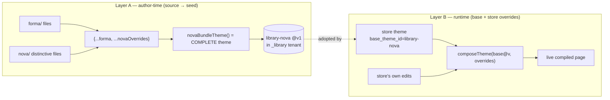
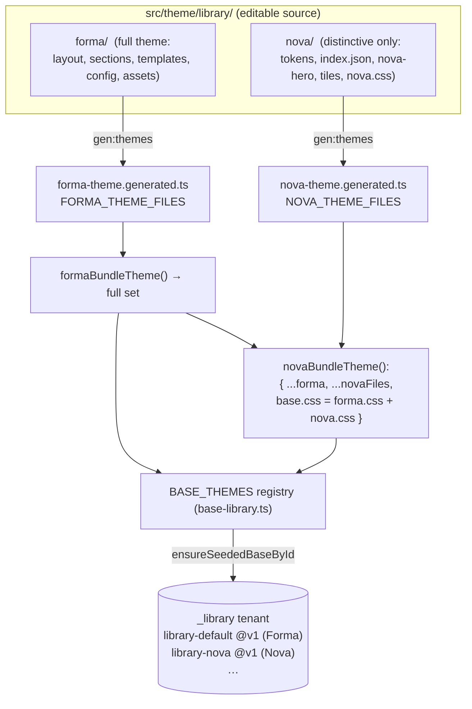
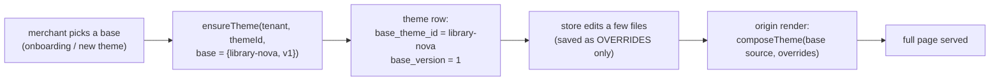
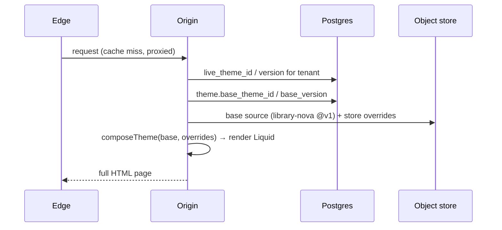
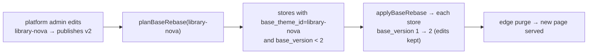
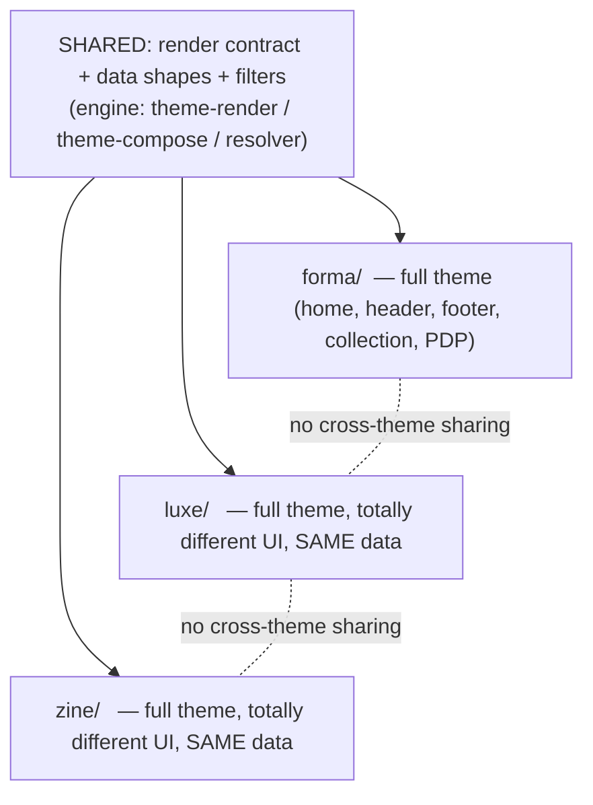

# Theme system architecture

This explains how base themes, stores, and rendering fit together — and answers the common question:
**"if Nova extends Forma, are the themes really separate?"**

> **Yes. Each base theme is a complete, self-contained theme at runtime.** "Extends Forma" happens only
> in the _source_, at build time, to avoid copy-pasting shared chrome. The built output is a full theme.

There are **two different composition steps** that are easy to conflate. Keep them apart:

|          | Layer A — author-time                                | Layer B — runtime                                         |
| -------- | ---------------------------------------------------- | --------------------------------------------------------- |
| What     | `novaBundleTheme() = { ...forma, ...novaOverrides }` | `store live theme = base@version ⊕ store edits`           |
| When     | when we author/generate a base's SEED                | on every storefront render, per store                     |
| Purpose  | DRY source — don't duplicate shared chrome           | multi-tenant lineage — a store keeps only its diffs       |
| Result   | a **complete** ThemeFiles set (all files)            | the store's **full** composed page                        |
| Coupling | Nova's _source_ reads Forma's _source_               | a store tracks its base by `base_theme_id`/`base_version` |

> **Compose-over-Forma is optional, not the model.** A theme is free to be **completely standalone** —
> its own home, header, footer, collection page, product page, sections, and CSS. Themes share **only
> the contract below** (the data shapes + render slots), never the UI. Forma just happens to be authored
> as a full standalone theme, and Nova/Aura/Atelier reuse its chrome as a shortcut because they're light
> variants today; a genuinely distinct theme should be a **full directory** (see the last section).

---

## What every theme shares: the contract, not the chrome

The ONLY things a theme must honor are the render contract and the data shapes. Everything visual is
per-theme. This is the "same data format, different UI" you get across themes.

**1. Render / layout contract** (enforced by `theme-render.ts`; a standalone theme MUST provide these):

| File                                                      | Role                                                                                   |
| --------------------------------------------------------- | -------------------------------------------------------------------------------------- |
| `layout/theme.liquid`                                     | owns the whole `<!doctype html>` document. Must include the slots below                |
| `templates/index.json`, `collection.json`, `product.json` | each lists section instances + `dataSources`                                           |
| `sections/<type>.liquid`                                  | every `type` a template references                                                     |
| `sections/header.liquid`, `sections/footer.liquid`        | chrome — origin renders them into `{{ header }}` / `{{ footer }}` with the store's nav |
| `sections/order.liquid`                                   | the thank-you page (checkout integration hydrates its line-items)                      |
| `config/tokens.json`, `assets/base.css`                   | brand tokens + the theme's own stylesheet                                              |

Layout slots the origin fills: `{{ content_for_layout }}` (the page's sections), `{{ header }}`,
`{{ footer }}`, `{{ base_css }}` / `{{ token_css }}` / `{{ theme_css }}`, `{{ content_for_header }}`
(islands runtime + security), `{{ content_for_body_end }}`, and escaped `page_title` / `site_name`.

**2. Data contract** — sections bind to a `dataSourceKey`; the resolver injects **canonical, flat** data
regardless of backend. A theme's Liquid reads these fields; the _layout_ around them is entirely yours:

| dataSource type                    | injects                  | shape the section reads                                                                                    |
| ---------------------------------- | ------------------------ | ---------------------------------------------------------------------------------------------------------- |
| `PRODUCTS` / `PRODUCTS_BY_HANDLES` | `{ products: [...] }`    | each product: `id, title, handle, price` (paise), `compare_at_price?`, `image_url`/`images`, `description` |
| `COLLECTION_BY_HANDLES`            | `{ products: [...] }`    | same product shape, filtered to the collection                                                             |
| `PRODUCT`                          | a flat product           | `title, handle, price, compare_at_price?, description, image_url/images, variant_id?/variants`             |
| `COLLECTIONS`                      | `{ collections: [...] }` | each: `handle, title`                                                                                      |

**3. Filters** — merchant/theme Liquid is untrusted; only `money` (paise → ₹), `escape`, `default` are
available. Prices are always paise; render with `| money`.

So: **build any header/home/collection/PDP you like** — as long as the layout has the slots, templates
reference real sections, and your Liquid reads the canonical product/collection fields, it renders on
the same data as every other theme.

---

## Layer A — how a base is built and seeded (author-time)

`forma/` is the **full flagship** theme (every file). `nova` / `aura` / `atelier` ship **only the files
that differ** and are composed over Forma in code, so shared chrome (header, footer, layout, collection
& product pages) isn't duplicated across four folders. The composed **output is still a complete root
theme** — it has all of Forma's files plus the theme's own.

Key points:

- **The seed is a snapshot.** `ensureSeededBaseById('library-nova')` publishes v1 = the _full_ composed
  file set. From then on it's **seed-only**: later changes to Forma's code never silently clobber an
  already-seeded base (see `base-library.ts`).
- **So each seeded base is independent at runtime** — `library-nova @v1` physically contains every file
  it needs. It does **not** reach back to Forma to render.
- The only cross-theme link is at the _source_ level: `novaBundleTheme()` calls `formaBundleTheme()`.
  That's the DRY shortcut, nothing more.

---

## Layer B — how a store uses a base (runtime base ⊕ overrides)

This is the multi-tenant part, and it's a **different** mechanism from Layer A. A store **adopts** one
base and stores only its own edits; the base is referenced by id + version.

- A store's **draft = only the files it changed**. Files it didn't touch come from the base.
- `composeTheme(base, overrides)` (see `theme-compose.ts`) merges them at read time; the store's **live
  compiled** theme (`loadLiveCompiled`) is the complete page. Nothing is missing — untouched files fall
  through to the base.
- This is why a store can pull a **base improvement** later without losing its edits → propagation.

### Render path (origin)

### Propagation (improve a base, roll it into its stores)

Because every store records which base + version it tracks, improving a base is a version bump the
stores can pull in — keeping their own edits (only files they didn't override advance).

Note this scopes **per base** (`WHERE base_theme_id = $1`) — a Nova improvement only touches Nova stores,
never Aura/Atelier/Forma stores.

---

## "Are the themes separate?" — the precise answer

- **At runtime: fully separate.** Each seeded base is a complete root theme; each store renders from its
  own adopted base @version ⊕ its own edits. Forma is not consulted when rendering a Nova store.
- **At source: Nova/Aura/Atelier share Forma's chrome by composition.** This is a deliberate DRY choice:
  fix the footer once in `forma/`, and every theme that doesn't override it gets the fix at its next
  seed. A theme diverges by dropping its own file in its dir (it wins over the inherited one).
- **You never get "missing" files.** Composing over Forma makes a theme a _superset_ — it inherits every
  shared file and adds its own. The failure mode is the opposite (inheriting a shared section you don't
  use), which is harmless (unused sections don't render).

## Standalone themes (the recommended shape for distinct themes)

A distinct theme — different home, header, footer, collection page, product page — should be a **full
standalone directory** like `forma/`: its own copy of every file, and a `*-theme.ts` that just returns
its own files (no `...forma`). It shares nothing but the [contract above](#what-every-theme-shares-the-contract-not-the-chrome).

**When to use which:**

- **Full standalone directory (default for a real, distinct theme).** Own everything. ➕ zero coupling —
  editing one theme never affects another; every page can look completely different. ➖ shared chrome is
  duplicated, so a cross-theme fix is per-theme (acceptable — distinct themes _want_ to diverge).
- **Compose-over-Forma (shortcut, for a light variant only).** Reuse Forma's chrome and change just
  tokens + a couple of sections (what Nova/Aura/Atelier do today). Use this only when a theme really is
  "Forma with a different home + palette." The moment it wants its own header/footer/collection/PDP,
  promote it to a full directory.

Runtime behaviour is **identical** either way — both produce a complete, seeded, self-contained theme.
The choice is purely about how much source you copy vs. inherit.

See [`library/README.md`](./library/README.md) for the step-by-step (both shapes).
