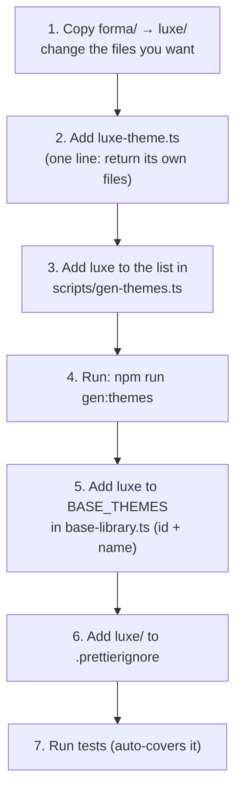
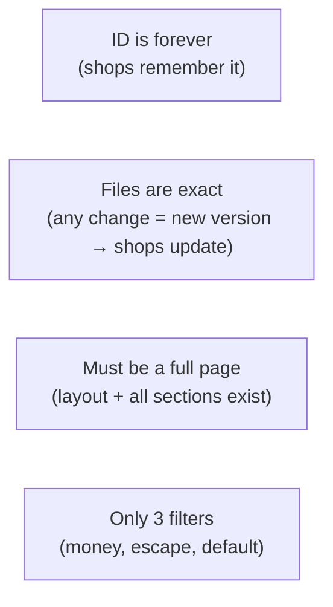

# How to add a new theme

A **theme** is a "start from" look a shop owner picks when they open a store (or make a new theme).
This folder keeps the **themes** (`forma`, `nova`, `aura`, `atelier`). The **engine** (the code that
runs themes) lives one folder up. Please keep them apart — put theme files here, not engine code.

Big picture — first read [`../ARCHITECTURE.md`](../ARCHITECTURE.md). In one line:

> **Every theme is its own full folder.** It has its own home, header, footer, collection page,
> product page and style. Themes share only the data and the page slots — never the look.

## The steps (example: a theme called `luxe`)



**1. Make the theme folder.** Copy `forma/` to `luxe/` and change what you want, page by page. Keep
these files (the system needs them):

- `layout/theme.liquid` — the full page shell, with the slots kept.
- `sections/header.liquid`, `sections/footer.liquid`, `sections/order.liquid`.
- `templates/index.json`, `templates/collection.json`, `templates/product.json` — and the sections they
  use.
- `config/tokens.json` — font, corner shape, text size. Do **not** put a brand colour here; the shop
  gives that.
- `assets/base.css` — the theme's **own full** style file.

Design each page however you like — just read the same product/collection fields, and keep the slots.
Keep at least one product row on the home page so a new shop is never empty.

**2. Add the small file** `luxe-theme.ts` — just one line that returns the theme's own files:

```ts
import type { ThemeFiles } from '../bundle';
import { LUXE_THEME_FILES } from './luxe-theme.generated';
export function luxeBundleTheme(): ThemeFiles {
  return { ...LUXE_THEME_FILES };
}
```

**3. Tell the generator about the folder** — add one line to the `THEMES` list in
`scripts/gen-themes.ts`:

```ts
{ dir: 'luxe', out: 'luxe-theme.generated.ts', exportName: 'LUXE_THEME_FILES' },
```

**4. Build it:** `npm run gen:themes`. This turns your folder into the `luxe-theme.generated.ts` code
file. Commit that file too.

**5. Add the theme to the list** in `../base-library.ts`:

```ts
export const LUXE_BASE_THEME_ID = 'library-luxe'; // id — never change it later
// …add to BASE_THEMES:
{ id: LUXE_BASE_THEME_ID, name: 'Luxe', description: 'Clean, high-end — for premium brands.', files: luxeBundleTheme },
```

The picker (in onboarding and the New-theme box) reads the list from the server, so your theme shows up
on its own — no UI change needed.

**6. Protect the theme files** — add your folder to `.prettierignore` (see the rules below):

```
packages/builder-core/src/theme/library/luxe/
```

**7. Test.** One test file checks the home, collection and product page of **every** theme in the list,
so your theme is covered as soon as it is added. Run:

```
npm run gen:themes && npm run typecheck && <builder-core tests>
```

## Simple rules to remember



- **The id is forever.** `library-<name>` is saved inside every shop that uses the theme. Choose it
  once and never rename it. The **name and description can change** any time.
- **Theme files are exact.** The file bytes decide the theme's version. If you change a file, the theme
  gets a new version and **every shop on it gets updated**. That is why theme folders are in
  `.prettierignore` (so auto-formatting does not cause a surprise update). Change theme files only when
  you really mean to ship a new version.
- **It must be a full page.** `layout/theme.liquid` must be a full HTML page (`<!doctype …>`), and every
  section a template names must exist as a file.
- **Theme code is not trusted.** Only the `money`, `escape` and `default` filters are allowed. Always
  `escape` any shop/merchant text.
